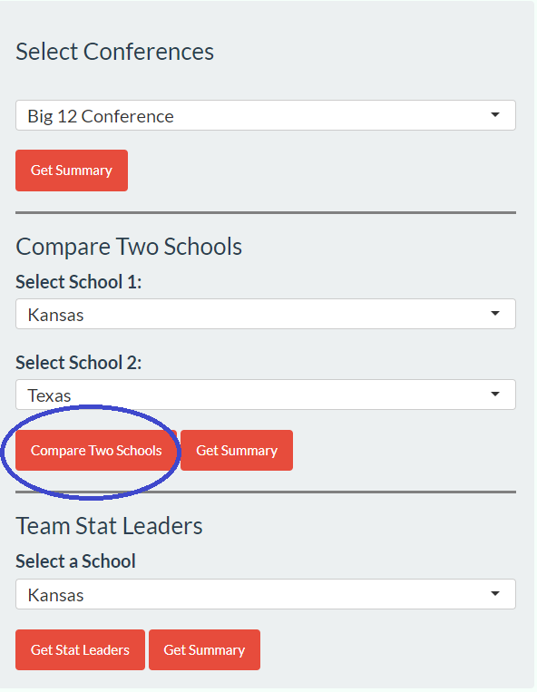
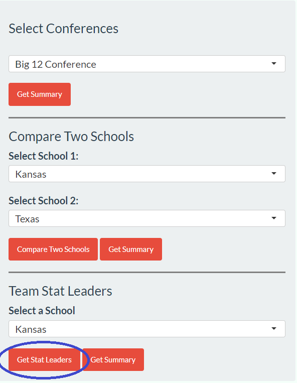
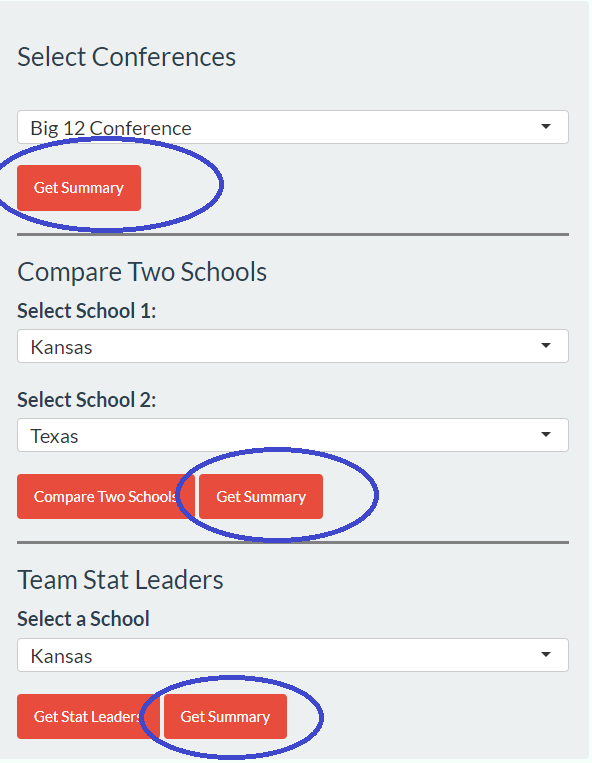
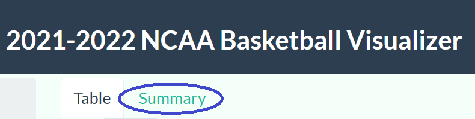

## Setup

```{r setup, include = FALSE}
```

## Introduction

In this project, we want to present the information of the NCAA Basketball games across the United States. According to the NBA, similarly, we think that the first thing people would like to know is that which school in which game conference, just like the NBA's Eastern Western Conference concept. Usually, there will be more competitions between schools in the same region so that it could be seen as a root to do further information statistics, classification and comparison. And then, in the the same game conference, we would like to compare the performance between two different school teams overall. Visualization is preferred, for graph is a fasinating way to convey as much information as possible with short content. Besides, except for the gerneral performance of schools, we would also like to show the accomplishment of players, just like ESPN or TNT to report the basketball athletes' data in a game, such as points, three-point shooting rate, steal rate, and cap rate.


codes for web-scraping: web_scrape.R
results for web-scraping: conference_list.csv, final_table.csv, player_data.csv
codes for Shiny app: ShinyApp.R,style.css
write-up: report.Rmd
tutorials: pictures in write-up

## Methods / Implementation

The first step is to get the data. All data used in this project are scraped from sports reference website(https://www.sports-reference.com/cbb/). The website only allows 20 requests in a minute, so system must sleep 3s after each request. We firstly get the conference summary including the each conference links and names. We consider all 36 conferences in division I, and each conference includes 8 to 15 schools. Secondly, by reading conference links, we get the link of schools in each conference. Then, we could scrape schools' per game data in 2021-2022 season. Here, we are interested in G(the number of games per school played this season), MP(minutes played per game), FG(field goals per game), FGA(field goal attempts per game), FG%(field goal percentage), 2P(2-point filed goals per game), 2PA(2-point field goal attempts per game), 2P%(2-point field goal percentage), 3P(3-point filed goals per game), 3PA(3-point field goal attempts per game), 3P%(3-point field goals percentage), FT(free throws per game), FTA(free throw attempts per game), FT%(free throw percentage), ORB(offensive rebounds per game), DRB(defensive rebounds per game), TRB(total rebounds per game), AST(assists per game), STL(steals per game), BLK(blocks per game), TOV(turnovers per game), PF(personal fouls per game) and PTS(points per game). Finally, we scrape the image of school logo. The "final_data.csv" includes the link of school, conference, image link of school logo, all features we are interested in.

We also create another csv file to record the players' data per game this season. Apart from features we mentioned above, we include one additional feature GS(games started). The "player_data.csv" includes players' name, all features we are interested in and schools they belong to. The code to generate these two data frames is stored in "get_df.R" file.

When designing the ShinyApp, we first want to give users the overall data of a particular conference, so we designed a selectorInput for user to choose a conference, and a table composed of all schools in this conference would pop out in the main panel, reflecting multiple statistics of this school during season 2021-2022. 

The second function of the Rshiny app, titled "Compare Two Schools," allows the user to compare the season statistics for two schools within the selected conference. The user can use the drop-down menus to select the two schools, and then click the red "Compare Two Schools" button. 



This will open a new window containing the logos of the schools and three side-by-side bar graphs comparing the shooting effiency, offensive, and defensive statistics of the two teams. 

In order to implement this app function, two select inputs and one action button were added to the side bar panel in the UI. The select inputs allow the user to select the two schools for comparison, and the choices for these select inputs update based on the conference selected previously (ie. only schools from the selected conference are shown in the drop-down menu). The "Compare Two Schools" action button, when clicked, will trigger the generation and display of a modal dialog. At the top of the modal dialog, images of the school logos are rendered, and below that, three stat comparison plots are shown. The plots are all grouped bar charts generated with ggplot2 with a separate bar for each school/stat, with the corresponding numerical value shown above each bar. This makes it easier for the user to quickly determine absolute differences in certain stat categories, and also make quick visual conclusions based on relative heights of the bars. The first plot focuses on overall season team shooting efficiency statistics, including field goal %, 2-point field goal %, 3-point field goal %, and free throw %. The second plot focuses on team per-game offensive statistics, including assists per game, offensive rebounds per game, points per game, and turnovers per game. Finally, the third plot focuses on team per-game defensive statistics, including blocks per game, steals per game, personal fouls per game, and defensive rebounds per game. 

Finally, to let the user to learn about the leading players of different statistics, we let the user to pick a particular school in the chosen conference, then click the "Get stat leaders" button.




A modal dialog would pop out, and the leading player of this school in every single statistic would be displayed, together with their leading value. Here we employed map funciton in purrr to render multiple text outputs in the modal dialog.


We use “Get summary” button to show the summary plots. After selecting a conference, pressing “Get summary” will generate four statistics plots to evaluate the teams in this conference. These four plots summary point efficiency (more points made and less point attempts indicate higher efficiency), point structure (the scatter plot shows the proportion of 2-points goal versus 3-points goal), rebound structure (the scatter plot shows the proportion of offensive rebounds versus defensive rebound), defense structure (the proportion of blocks versus steals). After selecting two schools in the comparison part, “Get summary” will show the comparison plots of players in these two schools with the same statistics. After selecting a school in “Get leader” part, “Get summary” will show plots to summarize the players in this school. The resulting summaries can be approached by clicking 'Get Summary' buttons as in the following figure:



And then switch the table to summary by clicking 'summary' as follows:



## Discussion & Conclusions

In general, for this project we intend to present and analyze the schools in the NCAA basketball tournament for the 2021 to 2022 season. It consists of two main parts. One is to crawl data from the web, and the second is to build the shiny app.

In the web crawling part, we mainly used the read_html function and we also converted all the crawled data information into tibble form, it is worth mentioning that in this, we also took into account the maximum number of requests and set the system rest time of 3 seconds. This is similar to the application we used in our last midterm.

In the shinyapp, our main page is grouped by division and presents a very visual representation of each school's individual metrics for the 2021 to 2022 seasons. And to illustrate in more detail the two-by-two comparison between schools in seasons 21 to 22, we use two selectInputs and an actionbutton. When the user selects two schools and clicks on the actionbutton, the mainPanel area displays a pop-up window with the data visualization results, which is partly done in the server using the ggplot function. The comparison part has three points, the first is the shooting efficiency, the second is the offensive efficiency statistics, and the third is the defensive efficiency statistics. In addition to that, we also counted the first person in each metric (15) of each school team's season game, so that we can see which player can influence which part of the game, and the more names appear, the more we can see the influence of that player on the game.

Overall, we used as much of the skills and knowledge from previous classes and assignments as possible in achieving the results for this final project
